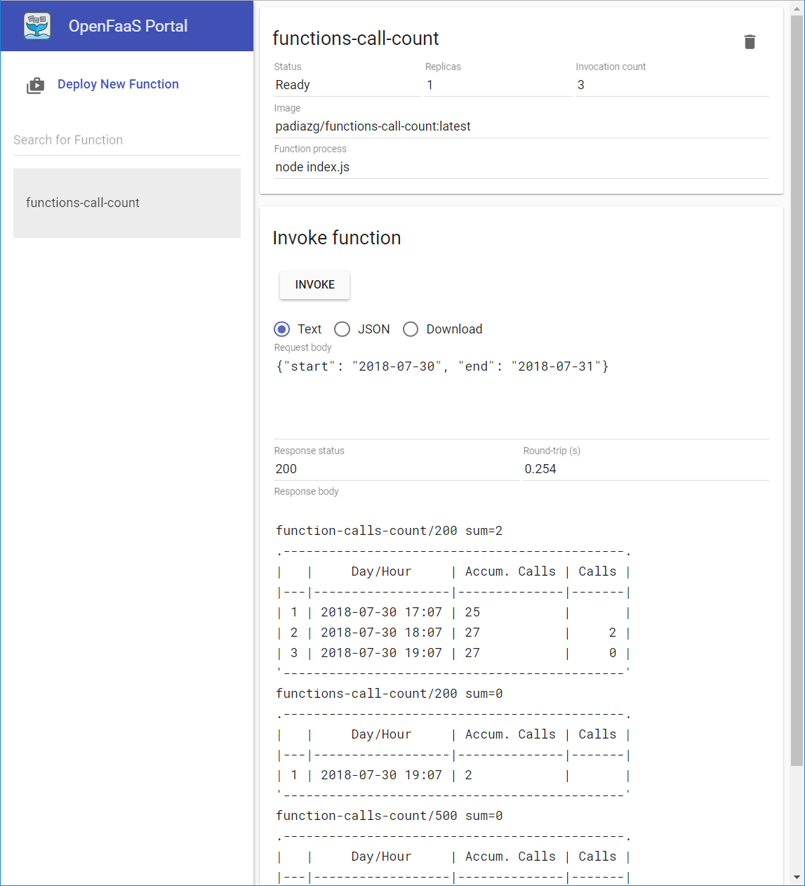
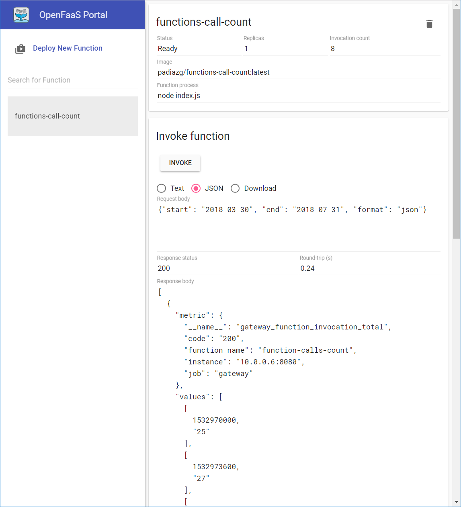

# OpenFaaS - Functions call count as a function

After having been using this [this](https://github.com/padiazg/functions-calls-count-cli) CLI project for a while I thought, why not turn it into a function?

> The structure of this project is based on [OpenFaaS with MongoDB] (https://github.com/alexellis/mongodb-function) from [@alexellisuk](https://twitter.com/alexellisuk)

## Before you start

1. Clone this repository
```bash
$ git clone https://github.com/padiazg/functions-calls-count-af.git
```
2. Replace "padiazg/" prefix from Docker Hub in stack.yml with your own account

3. Build/deploy
Create new function, make sure to specify ```call-count``` as the name of your function.
```bash
$ faas-cli new call-count --lang node
```
Now you can build/deploy
```bash
faas-cli build && faas-cli deploy
```

## Parameters:


## Examples
Output as ascii-table.  
* Select Text
* Request body: ```{"start": "2018-03-30", "end": "2018-07-31"}```


Output as JSON.  
* Select JSON
* Request body: ```{"start": "2018-03-30", "end": "2018-07-31",  "format": "json"}```

